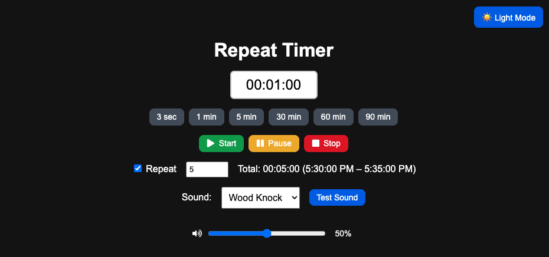

# Repeat Timer App

A customizable repeat timer built with React and TypeScript that plays a sound at the end of each interval. Great for workouts, study blocks, Pomodoros sessions, or any repetitive task.

---



---

## Features

- Set time via editable `HH:MM:SS` text input
- One-click presets (3 sec, 1 min, 5 min, 30 min, etc.)
- Start / Pause / Stop buttons with icons
- Repeat mode with customizable repeat count (1–100)
- Choose from ~6 different end-of-interval sounds (with volume control)
- Light/Dark mode toggle (remembers preference via `localStorage`)
- Shows total duration and time range 
- Displays total session duration and time range (start time – end time)
- End-of-session popup with friendly “Done” voice and time summary
- Volume slider with tooltip and percent indicator

---

## Tech Stack

- [React](https://reactjs.org/)
- [TypeScript](https://www.typescriptlang.org/)
- [React Icons](https://react-icons.github.io/react-icons/)
- CSS (custom + utility classes)

---

## Installation

**Install dependencies**

	npm install

**Start the development server**

	npm start

---

## Add Custom Sounds

Place your audio files in:

```
/public/sounds/
```

Example filenames:
```
wood-door-knock.mp3
guitar-alert.mp3
gaming-lock.mp3
correct-tone.mp3
magic-ring.mp3
church-bell.
done-woman-voice.mp3
```

Then update the `soundMap` in `App.tsx`:

```tsx
const soundMap: Record<string, string> = {
  "Wood Knock": "/sounds/wood-door-knock.mp3",
  "Guitar Alert": "/sounds/guitar-alert.mp3",
  "Gaming Lock": "/sounds/gaming-lock.mp3",
  "Correct Tone": "/sounds/correct-tone.mp3",
  "Magic Ring": "/sounds/magic-ring.mp3",
  "Church Bell": "/sounds/church-bell.mp3",
  "Done Voice": "/sounds/done-woman-voice.mp3",
};
```

---

## Project Structure

```
repeat-timer-app/
├── public/
│   └── sounds/
├── src/
│   ├── App.tsx
│   ├── index.tsx
│   └── index.css
├── package.json
└── README.md
```

---

## To-Do / Future Ideas

- Save last timer and repeat settings
- Add notification support across tabs (with fallback)
- Visual progress bar
- Keyboard shortcuts (e.g. space to pause/start)
- Store previous timer sessions